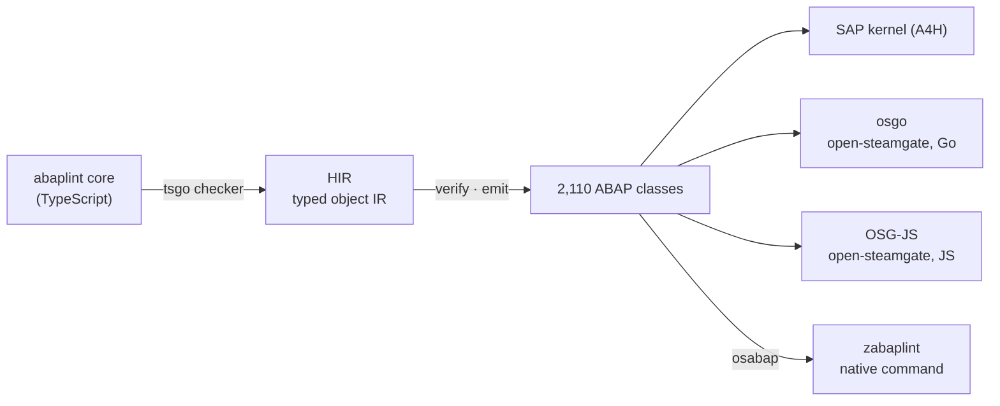
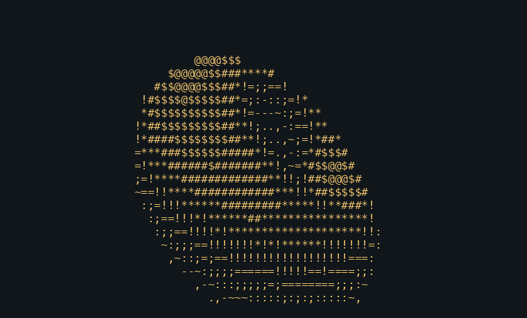

# ABAPiti

**ABAPiti: because we can**
*a new identity for your code*

[](https://github.com/oisee/abapiti/actions/workflows/ci.yml)

ABAPiti is a **TypeScript → ABAP** transpiler. Its first real job is to compile [abaplint](https://github.com/abaplint/abaplint) itself into ABAP, and later the [abaplint transpiler](https://github.com/abaplint/transpiler). The result runs off-stack, on [open-steamgate](https://github.com/oisee/open-steamgate) (Go and JS), and on-stack, on a real SAP kernel. That is a step towards self-hosting: the ABAP tooling running in ABAP.



**Status, 9 Oct 2026.** The translated abaplint checks `zabapgit_standalone.prog.abap` (159K lines) plus [abaplint/deps](https://github.com/abaplint/deps), using abapGit's [`ci/abaplint.json`](https://github.com/abapGit/abapGit/blob/main/ci/abaplint.json):

| Host | Check time | Result |
|---|---|---|
| SAP 7.58 kernel (A4H), background job | 230 s | = Node abaplint, byte for byte (SHA-256 of all issues) |
| open-steamgate Go (osgo) | 93 s | = Node |
| `zabaplint`, native command (Go) | 105 s | = Node |
| Node abaplint 2.120.56 | 13.5 s | reference |

A seeded variant with one error per rule gives Node's issues on every host. The stage-by-stage breakdown and how the time came down are in the [v0.1.0 release notes](https://github.com/oisee/abapiti/releases/tag/v0.1.0).

> **Not a general TypeScript → ABAP compiler yet.** The translator is tuned for one job, abaplint core at commit `577f875e` (2.120.56). The build is pruned to the code paths that checking zabapgit with the six rules above executes. A check that leaves those paths is refused with the TypeScript location of the missing code. It never gives a silently different answer. Making it general comes after self-hosting works.

## Quick start: three abaplints with one command

Download `abapiti` for your platform from the [latest release](https://github.com/oisee/abapiti/releases/latest), then:

```sh
abapiti abaplint -o out
```

This fetches abaplint 577f875e from GitHub (about 1.7 MB, every file checked against its recorded SHA-256), translates it in a few seconds and writes:

| Directory | For | Run it |
|---|---|---|
| `out/osg/` | open-steamgate, **osgo** and **OSG-JS** | in an [open-steamgate](https://github.com/oisee/open-steamgate) checkout: `npm run osgo:unit -- ../out/osg` or `npm run osgjs:unit -- ../out/osg` |
| `out/a4h/` | an **ABAP system** (7.50 or later) | import `abaplint-577f875e-a4h.zip` with abapGit, then run `ZABAPITI_REGISTRY_RUN` as a background job (see [A4H](docs/abaplint-cli.md#output)) |
| `out/native/` | a **native command** | `node tools/gogen/osabap.mjs ../out/native/zabaplint.prog.abap --lib ../out/native/lib` in open-steamgate, or take `zabaplint` from the release |

To have the open-steamgate output check zabapgit itself, pass the inputs. They are embedded into a driver class whose result is compared with Node's:

```sh
abapiti abaplint -o out --input zabapgit/ --deps deps/src --config abaplint.json
```

Narration is on by default: every step prints what it did, with counts and timings. `--quiet` turns it off. Details: [docs/abaplint-cli.md](docs/abaplint-cli.md).

### zabaplint: abaplint as one native command

The release also has `zabaplint` for Linux, macOS and Windows (amd64, arm64). It is the translated abaplint compiled TypeScript → ABAP → Go by open-steamgate's `osabap`:

```sh
zabaplint --file zabapgit_standalone.prog.abap --config abaplint.json \
          --deps deps.txt --times -allow-read .
```

`deps.txt` lists one dependency path per line, and `-allow-read` is the sandbox root for file reads. The output is the issue count, then one line per issue: `key|severity|file|row:col|row:col|message`.

## Reproduce everything from scratch

```sh
git clone https://github.com/oisee/abapiti && cd abapiti
go build -o abapiti ./cmd/abapiti          # Go 1.26
./abapiti abaplint -o out                   # or: ./abapiti abaplint ~/src/abaplint -o out
go test ./hir/... ./tsfront ./cmd/...       # unit tests, emitter fixtures, the generation gate
```

- **Runtimes.** CI runs the feature fixtures as ABAP Unit on osgo and OSG-JS at the pinned open-steamgate (`.github/ci/osgo.ref`).
- **Kernel.** The kernel runs used a permanent package on A4H. The driver reads zabapgit from the table `ZABAPITI_CORPUS`, which is created by the abapGit package in [`tools/allbackends/corpus-abap/`](tools/allbackends/corpus-abap/). The builder for its input archive is still a local script and comes with the next release.
- **Node reference.** The Node reference is the same harness ([`registry_run.ts`](tsfront/testdata/registrycorpus/harness/registry_run.ts)) run on abaplint's own TypeScript.
- **Pruning.** The reachability manifest that decides which bodies are compiled was recorded with [`tools/registry-coverage.mjs`](tools/registry-coverage.mjs) (ADR [0009](docs/adr/0009-reachability-pruning.md)).

How it works in more depth: [the ADRs](docs/adr/) (own object HIR, tsgo front end, ABAP 7.50 target, number semantics, reachability pruning).

Super greets to [@larshp](https://github.com/larshp) for abaplint, the transpiler and the acceptance test: check `zabapgit_standalone` on the stack in under 5 minutes.

<details>
<summary><b>Before TypeScript: WebAssembly, LLVM IR and C → ABAP</b> (QuickJS, Lua, Monocypher, QR codes and a donut on the SAP kernel)</summary>

## News

**2026-10-03 — three small programs run on the kernel bit for bit; JavaScript engines compared.**
- A QR-code encoder (Nayuki's qrcodegen, 16 KB of wasm), the Lua 5.4 interpreter (710 KB, five classes, 8/8 scripts) and Andy Sloane's donut.c (doubles, sin/cos) run on A4H and osgo and give the native answers, once signed division is exact (#23). The QR below came out of the SAP spool and scans; the donut frame too.
- Three ways to run JavaScript in ABAP, on native, Node, osgo, OSG-JS and A4H: QuickJS compiled by ABAPiti, [zmjs](https://github.com/oisee/zmjs) and Lars Hvam's [zqjs](https://github.com/larshp/zqjs) (both hand-written in ABAP). On the kernel zqjs answers 12 of our 16 test scripts, 4–60× faster than QuickJS compiled from wasm on those, but 8.6× slower on sorting 10,000 numbers; QuickJS answers all 16. zmjs was not timed. That is why the next step is speed, and why [SUPER-PLANS.md](docs/SUPER-PLANS.md) puts a typed IR (`llvm/`) forward as the production path.
- Honest status: only the WebAssembly path is really verified (CI on wazero, osgo and OSG-JS, plus the kernel runs above). The `llvm/` and TypeScript paths compile, but beyond five small C functions run once on SAP nothing they produce has been executed or checked.
- Runtime gaps found on the way went to [open-steamgate](https://github.com/oisee/open-steamgate/issues?q=label%3Akernel-diff) (#537–#543, label `kernel-diff`).

<p>
  
  
</p>

**2026-10-03 — QuickJS runs on a real SAP kernel.** Fabrice Bellard's [QuickJS](https://bellard.org/quickjs/) JavaScript engine, built for WebAssembly without SIMD (1.0 MB) and compiled by ABAPiti into 13 interfaces, a state class, 13 chunk classes and a facade (253K lines of ABAP), activates object by object on A4H (28/28 in 87 s) and evaluates JavaScript inside ABAP: `1+2`, a loop to 100, `Array.sort`, `JSON.stringify`, a recursive `fib(15)`, `toUpperCase`, `Math.sqrt`, `Map` and `RegExp`, and `printf` through WASI, all equal to the same module in wazero. The 9 tests take about 2 s on the kernel; the same classes pass on open-steamgate's Go runtime (osgo) too. Getting there needed kernel-valid runtime helpers, unique 30-character names, a nesting depth under the kernel's limit of about 128, and a split whose classes depend only on interfaces, so each one activates on its own.

## Why? Because we can.

ABAPiti compiles WebAssembly, LLVM IR (so C, and in principle anything clang or rustc can lower) and TypeScript **into** ABAP, in the demoscene spirit of doing something just to see that it runs.
It is the reverse direction of [abaplint/transpiler](https://github.com/abaplint/transpiler), which takes ABAP out to JavaScript; ABAPiti brings other languages in.
None of this is production software. It is a research toy that happens to produce ABAP a real SAP system accepts.

The story so far, with the bugs and the measurements, is a chapter of the open-steamgate demo book:
**[“Because we can: C in ABAP”](https://github.com/oisee/osg-demo/blob/main/book/18-c-in-abap.md)**
([по-русски](https://github.com/oisee/osg-demo/blob/main/book/ru/18-c-in-abap.md)).

## A taste

This C, compiled to WebAssembly by clang:

```c
static void qs(int lo, int hi) {
  if (lo >= hi) return;
  int p = a[(lo + hi) / 2], i = lo, j = hi;
  while (i <= j) {
    while (a[i] < p) i++;
    while (a[j] > p) j--;
    if (i <= j) { int t = a[i]; a[i] = a[j]; a[j] = t; i++; j--; }
  }
  qs(lo, j); qs(i, hi);
}
```

becomes ABAP like this (32-bit multiplication with WebAssembly's wrap-around, which a plain `TYPE i` would turn into an overflow dump):

```abap
lv_w = s1.
lv_w = lv_w * s2.
lv_w = lv_w MOD 4294967296.
IF lv_w > 2147483647.
  lv_w = lv_w - 4294967296.
ENDIF.
s1 = lv_w.
```

Generated code has no comments, no line longer than 255 characters (the limit the ABAP editor enforces), keeps the WebAssembly memory in one `xstring` changed in place with `REPLACE SECTION`, and needs nothing installed on the system besides the class itself.

## What runs today

Every case is checked against the same program run natively (C compiled by gcc, and [wazero](https://wazero.io)), bit for bit.

| Rung | Size | SAP kernel (A4H) | OSG-JS | osgo |
|---|---|---|---|---|
| add, factorial | 62 bytes of wasm | 7/7, 7/7 | green in CI | green in CI |
| Arithmetic edge cases (i32/i64 wrap, shifts, branches, memory.grow, saturating truncation, float traps) | 796 tests | via the corpus | green in CI | green in CI |
| C corpus: qsort, base64, crc32, fnv1a64, xorshift64*, Life, Mandelbrot, queens, sieve, recursion, function pointers, a Brainfuck interpreter | 9 KB of wasm, 38 checks | **38/38** | 12/12 programs | **38/38** |
| [Monocypher](https://monocypher.org): BLAKE2b, X25519, ChaCha20, Poly1305, Ed25519 sign and check | 53 KB of wasm → 5,209 lines | **10/10** in 29 s | 10/10 | **10/10** in 78 s |
| [QuickJS](https://bellard.org/quickjs/) built without SIMD: JavaScript eval inside ABAP | 1.0 MB of wasm → 253K lines in 15 classes + 13 interfaces | **9/9**, 28/28 objects activated | | **9/9** |

A sorted array of 500 numbers takes 6.1 ms on the kernel. What is still a draft or left out is listed in [docs/TECH-DEBT.md](docs/TECH-DEBT.md).

## What?

One Go module, one CLI (`abapiti`), several frontends. Status as of 2026-10-03:

| Frontend | Input → output | What works today | What does not (yet) |
|---|---|---|---|
| **`wasm/`** (WASM → ABAP, Go) | `.wasm` → a self-contained global ABAP class (`METHODS` per export, linear memory as `xstring`); large modules split into a state class, chunk classes and one interface per chunk, each activatable on its own (`--split`, `--class-lines`); generated nesting stays below the kernel's limit. Backends: class, function group, hybrid, multi-class. | See *What runs today*. i32 and i64 arithmetic wraps like WebAssembly; branches, loops, `call_indirect`, `memory.grow`, sign extension, bulk memory. | Exceptions, SIMD, atomics; f32 is computed in double precision; NaN/Inf trap. See [docs/TECH-DEBT.md](docs/TECH-DEBT.md). |
| **`abap/wasm_compiler/`** (WASM → ABAP, written in ABAP) | `.wasm` xstring → ABAP source, then `GENERATE SUBROUTINE POOL` on SAP | Self-hosting run on SAP (a 785-line compiler); it has an ABAP Unit class. | Not packaged for installation. Depends on `GENERATE SUBROUTINE POOL`, which OSD most likely cannot run. |
| **`llvm/`** (LLVM IR / C → ABAP) | `.ll` or `.c` (via `clang`) → typed `CLASS-METHODS`; optional abapGit zip; multi-class split | 3 tests pass (a 34-function C corpus, leaf functions, control flow). FatFS: 28 functions → 8,016 lines, 0 TODOs, verified 5/5 on SAP via `GENERATE SUBROUTINE POOL`. QuickJS: 537 methods / 124 K lines, 0 TODOs. | QuickJS-as-ABAP is verified only natively (via `llc`), not on SAP. Test coverage is thin. `.c` input needs `clang` on the PATH. |
| **`ts/`** (TypeScript → ABAP) | TS → JSON AST (node + `ts/ts_ast.js`) → ABAP classes | A lexer modelled on abaplint's was transpiled to ABAP (55 classes in `ts/testdata/abaplint_lexer/`) and ran on SAP. | Needs node and `npm install` at runtime, and finds `ts_ast.js` only from a source checkout (or `ABAPITI_TS_AST_PATH`). Its test skips without the TypeScript toolchain. |
| **`ts2go/`** (TypeScript → Go) | TS AST → Go | Produced valid Go from the same lexer. | No tests, no caller. |
| **`jseval/`** + **`abap/jseval/`** | A JavaScript interpreter in Go (the oracle) and in ABAP (`ZCL_JSEVAL*`) | The Go side passes 109 subtests; the ABAP side ran on SAP (v0.3.3). | No harness yet runs both on the same inputs. |
| Go → ABAP | | Does not exist. | |

Other bits: `cmd/abapgit-pack/` packs `.abap` files into an abapGit zip, `abap/abaplint-lexer.zip` is the transpiled lexer as an abapGit package, and `fun/` has examples and the QuickJS-on-SAP write-up.

### Usage

```sh
go install github.com/oisee/abapiti/cmd/abapiti@latest

abapiti compile wasm add.wasm -o out/          # out/zcl_wasm_add.clas.abap
abapiti add.wasm                               # shortcut for "compile wasm", to stdout
abapiti compile llvm prog.c --class zcl_prog   # needs clang
abapiti compile llvm prog.ll --zip -o prog.zip # abapGit zip
abapiti compile ts lexer.ts -o out/            # needs node + npm install, from a checkout
abapiti abaplint -o out/                       # abaplint core → ABAP, no Node needed
```

`abapiti abaplint` translates abaplint's core (commit 577f875e, `@abaplint/core` 2.120.56) into 2,110 ABAP classes and interfaces, packaged for A4H (abapGit zip), open-steamgate unit runners and open-steamgate's native build. The build is pruned to what checking zabapgit_standalone with abapGit's `ci/abaplint.json` executes; see [docs/abaplint-cli.md](docs/abaplint-cli.md).

ABAPiti never talks to SAP. Deploy the output with [vsp](https://github.com/oisee/vibing-steampunk) (`vsp deploy out/zcl_wasm_add.clas.abap '$TMP'`) or abapGit.

## How it's verified

Today: Go unit tests (`go test ./...`), including a native run of the WASM inputs in wazero as the reference; in CI the generated classes run as ABAP Unit on osgo (open-steamgate's Go runtime, straight from the files) and on OSD through ADT ([`osd-m1.yml`](.github/workflows/osd-m1.yml)); larger programs are run on a real kernel (A4H) with throwaway packages, and the results are summarised above.
CI (`.github/workflows/ci.yml`, the same checks as vsp's) runs on every pull request and push to main: build, vet, the tests with `-race` and a shuffled order, a clean tree after them, a lint gate on new code, and a leak scan; complexity metrics, a full lint and a "does the new test fail without the fix" check are advisory. One bot comment per pull request (`ci-report.yml`) sums them up, with deltas against main.

The target pipeline, per test case:

1. Compile the input with `abapiti` and generate an ABAP Unit class whose expected values come from a native run (wazero for WASM, clang for C).
2. Deploy both with `vsp` to the [open-steamgate](https://github.com/oisee/open-steamgate) emulator (OSD), activate, and run the ABAP Unit tests.
3. Compare the ABAP results with the native ones; any difference fails the build.

OSD activates code through the abaplint transpiler, so a green OSD run proves the generated ABAP passes abaplint and behaves correctly under that runtime. It does not prove kernel behaviour (`TYPE i` overflow, for one); that stays a check on a real system. The kernel behaviour the generated code relies on is pinned by the ABAP Unit repros in [`abap/osd_repro/`](abap/osd_repro/), measured on a real system.

## Roadmap

- **M1 (done):** `abapiti compile wasm` output for **add** and **factorial**, plus the generated ABAP Unit class, deploys, activates and runs green on a pinned OSD in CI ([`osd-m1.yml`](.github/workflows/osd-m1.yml)) and on a real kernel, including i32 wrap-around.
- **M2 (done on the kernel and osgo):** the size ladder: the C corpus, Monocypher, and QuickJS evaluating JavaScript inside ABAP. QuickJS on OSG-JS is still to run.
- **M3:** the TypeScript-transpiled lexer vs the `@abaplint/core` lexer on the same inputs.
- **M4:** jseval (Go) and ZCL_JSEVAL (ABAP) conformance.

</details>

## History

ABAPiti was split out of [oisee/vibing-steampunk](https://github.com/oisee/vibing-steampunk) (vsp) with its git history: the commits that touched the transpilers keep their original authors and dates, trimmed to the moved paths. The design notes and session logs from that time are in [`docs/history/`](docs/history/); paths there still say `pkg/wasmcomp`, `pkg/llvm2abap` and `vsp compile`, which are now `wasm/`, `llvm/` and `abapiti compile`.

## License

MIT, see [LICENSE](LICENSE). Third-party notices are in [NOTICE](NOTICE).
