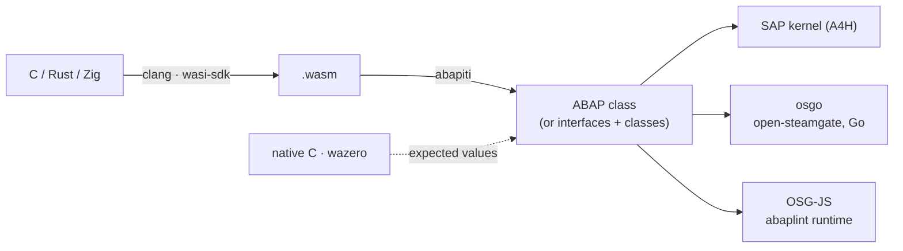

# ABAPiti

**ABAPiti: because we can**
*a new identity for your code*

[](https://github.com/oisee/abapiti/actions/workflows/ci.yml)



## News

**2026-10-03 — QuickJS runs on a real SAP kernel.** Fabrice Bellard's [QuickJS](https://bellard.org/quickjs/) JavaScript engine, built for WebAssembly without SIMD (1.0 MB) and compiled by ABAPiti into 13 interfaces, a state class, 13 chunk classes and a facade (253K lines of ABAP), activates object by object on A4H (28/28 in 87 s) and evaluates JavaScript inside ABAP: `1+2`, a loop to 100, `Array.sort`, `JSON.stringify`, a recursive `fib(15)`, `toUpperCase`, `Math.sqrt`, `Map` and `RegExp`, and `printf` through WASI, all equal to the same module in wazero. The 9 tests take about 2 s on the kernel; the same classes pass on open-steamgate's Go runtime (osgo) too. Getting there needed kernel-valid runtime helpers, unique 30-character names, a nesting depth under the kernel's limit of about 128, and a split whose classes depend only on interfaces, so each one activates on its own.

## Why? Because we can.

ABAPiti compiles WebAssembly, LLVM IR (so C, and in principle anything clang or rustc can lower) and TypeScript **into** ABAP, in the demoscene spirit of doing something just to see that it runs.
It is the reverse direction of [abaplint/transpiler](https://github.com/abaplint/transpiler), which takes ABAP out to JavaScript; ABAPiti brings other languages in.
None of this is production software. It is a research toy that happens to produce ABAP a real SAP system accepts.

The story so far, with the bugs and the measurements, is a chapter of the open-steamgate demo book:
**[“Because we can: C in ABAP”](https://github.com/oisee/osg-demo/blob/main/book/18-c-in-abap.md)**
([по-русски](https://github.com/oisee/osg-demo/blob/main/book/ru/18-c-in-abap.md)).

## A taste

This C, compiled to WebAssembly by clang:

```c
static void qs(int lo, int hi) {
  if (lo >= hi) return;
  int p = a[(lo + hi) / 2], i = lo, j = hi;
  while (i <= j) {
    while (a[i] < p) i++;
    while (a[j] > p) j--;
    if (i <= j) { int t = a[i]; a[i] = a[j]; a[j] = t; i++; j--; }
  }
  qs(lo, j); qs(i, hi);
}
```

becomes ABAP like this (32-bit multiplication with WebAssembly's wrap-around, which a plain `TYPE i` would turn into an overflow dump):

```abap
lv_w = s1.
lv_w = lv_w * s2.
lv_w = lv_w MOD 4294967296.
IF lv_w > 2147483647.
  lv_w = lv_w - 4294967296.
ENDIF.
s1 = lv_w.
```

Generated code has no comments, no line longer than 255 characters (the limit the ABAP editor enforces), keeps the WebAssembly memory in one `xstring` changed in place with `REPLACE SECTION`, and needs nothing installed on the system besides the class itself.

## What runs today

Every case is checked against the same program run natively (C compiled by gcc, and [wazero](https://wazero.io)), bit for bit.

| Rung | Size | SAP kernel (A4H) | OSG-JS | osgo |
|---|---|---|---|---|
| add, factorial | 62 bytes of wasm | 7/7, 7/7 | green in CI | green in CI |
| Arithmetic edge cases (i32/i64 wrap, shifts, branches, memory.grow, saturating truncation, float traps) | 796 tests | via the corpus | green in CI | green in CI |
| C corpus: qsort, base64, crc32, fnv1a64, xorshift64*, Life, Mandelbrot, queens, sieve, recursion, function pointers, a Brainfuck interpreter | 9 KB of wasm, 38 checks | **38/38** | 12/12 programs | **38/38** |
| [Monocypher](https://monocypher.org): BLAKE2b, X25519, ChaCha20, Poly1305, Ed25519 sign and check | 53 KB of wasm → 5,209 lines | **10/10** in 29 s | 10/10 | **10/10** in 78 s |
| [QuickJS](https://bellard.org/quickjs/) built without SIMD: JavaScript eval inside ABAP | 1.0 MB of wasm → 253K lines in 15 classes + 13 interfaces | **9/9**, 28/28 objects activated | | **9/9** |

A sorted array of 500 numbers takes 6.1 ms on the kernel. What is still a draft or left out is listed in [docs/TECH-DEBT.md](docs/TECH-DEBT.md).

## What?

One Go module, one CLI (`abapiti`), several frontends. Status as of 2026-10-03:

| Frontend | Input → output | What works today | What does not (yet) |
|---|---|---|---|
| **`wasm/`** (WASM → ABAP, Go) | `.wasm` → a self-contained global ABAP class (`METHODS` per export, linear memory as `xstring`); large modules split into a state class, chunk classes and one interface per chunk, each activatable on its own (`--split`, `--class-lines`); generated nesting stays below the kernel's limit. Backends: class, function group, hybrid, multi-class. | See *What runs today*. i32 and i64 arithmetic wraps like WebAssembly; branches, loops, `call_indirect`, `memory.grow`, sign extension, bulk memory. | Exceptions, SIMD, atomics; f32 is computed in double precision; NaN/Inf trap. See [docs/TECH-DEBT.md](docs/TECH-DEBT.md). |
| **`abap/wasm_compiler/`** (WASM → ABAP, written in ABAP) | `.wasm` xstring → ABAP source, then `GENERATE SUBROUTINE POOL` on SAP | Self-hosting run on SAP (a 785-line compiler); it has an ABAP Unit class. | Not packaged for installation. Depends on `GENERATE SUBROUTINE POOL`, which OSD most likely cannot run. |
| **`llvm/`** (LLVM IR / C → ABAP) | `.ll` or `.c` (via `clang`) → typed `CLASS-METHODS`; optional abapGit zip; multi-class split | 3 tests pass (a 34-function C corpus, leaf functions, control flow). FatFS: 28 functions → 8,016 lines, 0 TODOs, verified 5/5 on SAP via `GENERATE SUBROUTINE POOL`. QuickJS: 537 methods / 124 K lines, 0 TODOs. | QuickJS-as-ABAP is verified only natively (via `llc`), not on SAP. Test coverage is thin. `.c` input needs `clang` on the PATH. |
| **`ts/`** (TypeScript → ABAP) | TS → JSON AST (node + `ts/ts_ast.js`) → ABAP classes | A lexer modelled on abaplint's was transpiled to ABAP (55 classes in `ts/testdata/abaplint_lexer/`) and ran on SAP. | Needs node and `npm install` at runtime, and finds `ts_ast.js` only from a source checkout (or `ABAPITI_TS_AST_PATH`). Its test skips without the TypeScript toolchain. |
| **`ts2go/`** (TypeScript → Go) | TS AST → Go | Produced valid Go from the same lexer. | No tests, no caller. |
| **`jseval/`** + **`abap/jseval/`** | A JavaScript interpreter in Go (the oracle) and in ABAP (`ZCL_JSEVAL*`) | The Go side passes 109 subtests; the ABAP side ran on SAP (v0.3.3). | No harness yet runs both on the same inputs. |
| Go → ABAP | | Does not exist. | |

Other bits: `cmd/abapgit-pack/` packs `.abap` files into an abapGit zip, `abap/abaplint-lexer.zip` is the transpiled lexer as an abapGit package, and `fun/` has examples and the QuickJS-on-SAP write-up.

### Usage

```sh
go install github.com/oisee/abapiti/cmd/abapiti@latest

abapiti compile wasm add.wasm -o out/          # out/zcl_wasm_add.clas.abap
abapiti add.wasm                               # shortcut for "compile wasm", to stdout
abapiti compile llvm prog.c --class zcl_prog   # needs clang
abapiti compile llvm prog.ll --zip -o prog.zip # abapGit zip
abapiti compile ts lexer.ts -o out/            # needs node + npm install, from a checkout
```

ABAPiti never talks to SAP. Deploy the output with [vsp](https://github.com/oisee/vibing-steampunk) (`vsp deploy out/zcl_wasm_add.clas.abap '$TMP'`) or abapGit.

## How it's verified

Today: Go unit tests (`go test ./...`), including a native run of the WASM inputs in wazero as the reference; in CI the generated classes run as ABAP Unit on osgo (open-steamgate's Go runtime, straight from the files) and on OSD through ADT ([`osd-m1.yml`](.github/workflows/osd-m1.yml)); larger programs are run on a real kernel (A4H) with throwaway packages, and the results are summarised above.
CI (`.github/workflows/ci.yml`, the same checks as vsp's) runs on every pull request and push to main: build, vet, the tests with `-race` and a shuffled order, a clean tree after them, a lint gate on new code, and a leak scan; complexity metrics, a full lint and a "does the new test fail without the fix" check are advisory. One bot comment per pull request (`ci-report.yml`) sums them up, with deltas against main.

The target pipeline, per test case:

1. Compile the input with `abapiti` and generate an ABAP Unit class whose expected values come from a native run (wazero for WASM, clang for C).
2. Deploy both with `vsp` to the [open-steamgate](https://github.com/oisee/open-steamgate) emulator (OSD), activate, and run the ABAP Unit tests.
3. Compare the ABAP results with the native ones; any difference fails the build.

OSD activates code through the abaplint transpiler, so a green OSD run proves the generated ABAP passes abaplint and behaves correctly under that runtime. It does not prove kernel behaviour (`TYPE i` overflow, for one); that stays a check on a real system. The kernel behaviour the generated code relies on is pinned by the ABAP Unit repros in [`abap/osd_repro/`](abap/osd_repro/), measured on a real system.

## Roadmap

- **M1 (done):** `abapiti compile wasm` output for **add** and **factorial**, plus the generated ABAP Unit class, deploys, activates and runs green on a pinned OSD in CI ([`osd-m1.yml`](.github/workflows/osd-m1.yml)) and on a real kernel, including i32 wrap-around.
- **M2 (done on the kernel and osgo):** the size ladder: the C corpus, Monocypher, and QuickJS evaluating JavaScript inside ABAP. QuickJS on OSG-JS is still to run.
- **M3:** the TypeScript-transpiled lexer vs the `@abaplint/core` lexer on the same inputs.
- **M4:** jseval (Go) and ZCL_JSEVAL (ABAP) conformance.

## History

ABAPiti was split out of [oisee/vibing-steampunk](https://github.com/oisee/vibing-steampunk) (vsp) with its git history: the commits that touched the transpilers keep their original authors and dates, trimmed to the moved paths. The design notes and session logs from that time are in [`docs/history/`](docs/history/); paths there still say `pkg/wasmcomp`, `pkg/llvm2abap` and `vsp compile`, which are now `wasm/`, `llvm/` and `abapiti compile`.

## License

MIT, see [LICENSE](LICENSE). Third-party notices are in [NOTICE](NOTICE).
